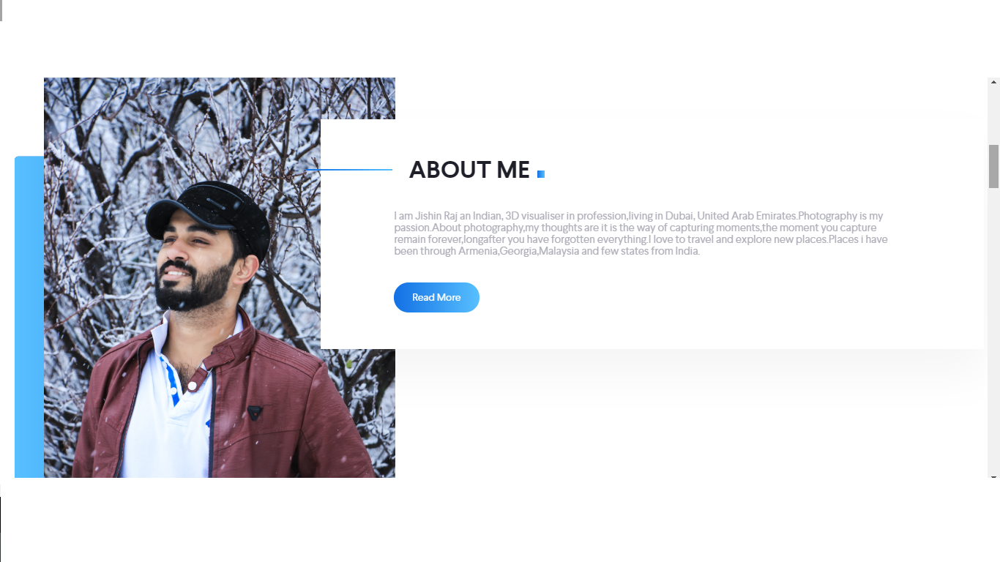

# django_personalportfolio
Jishin Raj personal portfolio, a 3D visualizer in profession,photography in passion living in Dubai. 
Website has root file name- bio.
Static folder contains - all static files
Template folder contains- "home.html"
Folder name [personal] is a apps
bio/personal/urls.py - urls patterns
bio/personal/views- contains home page view function 
html & other static file template used from photogenic- https://themewagon.com/themes/free-html5-bootstrap-4-portfolio-website-template-photogenic/#comment-72069

website address - https://jishinphotography.herokuapp.com/

